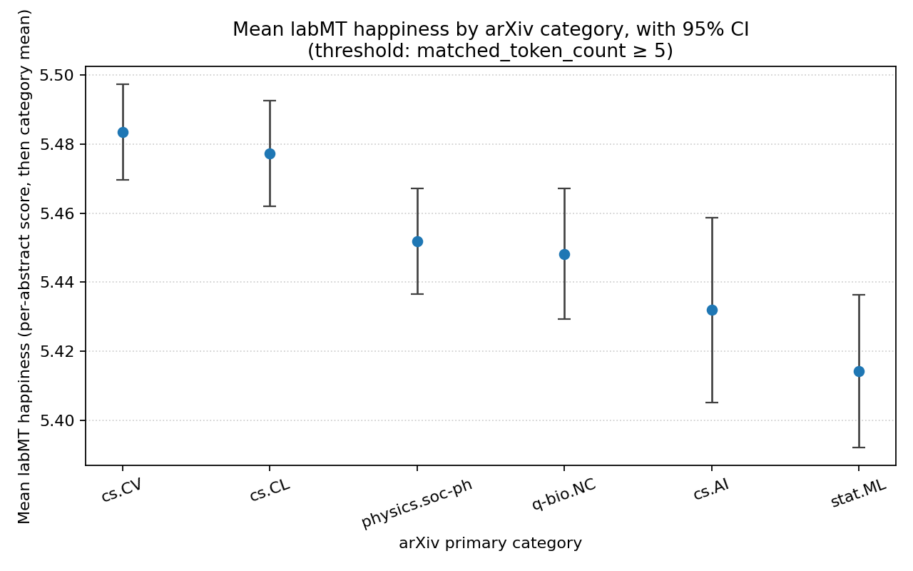
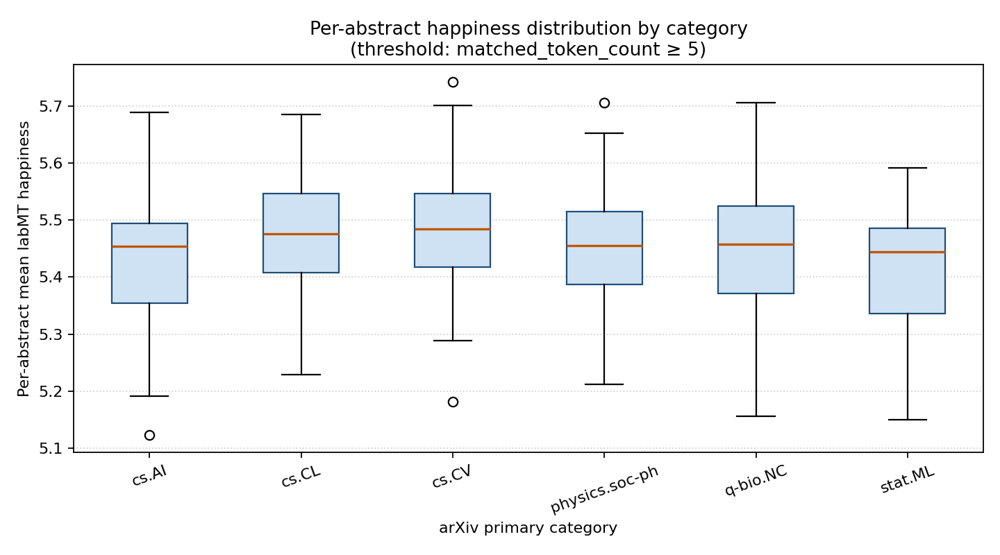
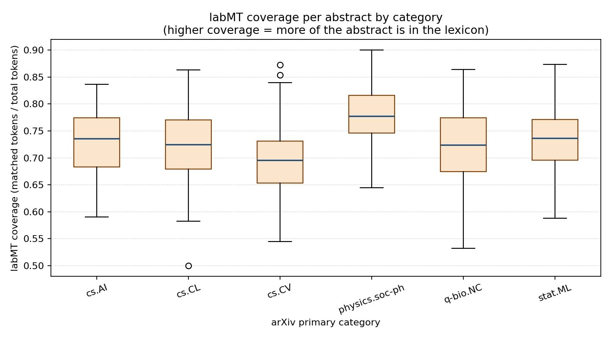
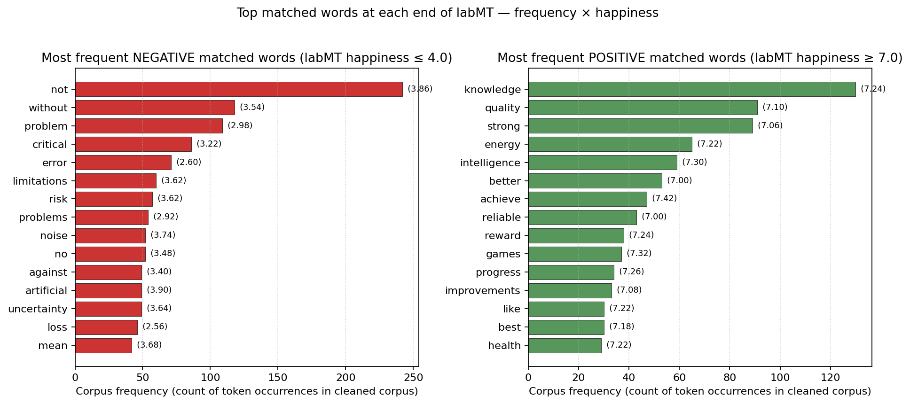

# Disciplinary Vocabularies, Not Disciplinary Moods: Reading labMT on arXiv Abstracts

> **Repair / resit submission for *Coding the Humanities* (UvA).**
> This README is written to make the research question, evidence, limits,
> and workflow explicit.

---

## 1. Overview

This project asks how the **labMT 1.0** happiness lexicon
(Dodds et al. 2011) behaves when it is used as a measurement instrument
on **arXiv abstracts**. I fetch ~200 abstracts each from six arXiv
primary categories (`cs.AI`, `cs.CL`, `cs.CV`, `stat.ML`,
`physics.soc-ph`, `q-bio.NC`), score every abstract with labMT, and
compare the resulting per-category distributions.

The headline is not "which research field is happiest". It is the
opposite: **the differences I observe between categories are real and
measurable, but they are about disciplinary vocabulary and abstract-writing
conventions, not about the emotional states of researchers or fields.**
The repository is built to show exactly *why* a careful reader cannot
make the stronger claim, even if the means and CIs invite it.

## 2. Research question

> How does labMT-based happiness differ across arXiv research categories,
> and what do those differences reveal about the limits of using a
> general-purpose happiness lexicon on technical academic abstracts?

## 3. Main claim

Per-category mean labMT happiness scores **do** differ across the six
arXiv categories I sampled, with category means separated by at most
**0.069 points on the 1–9 labMT scale** (cs.CV at 5.483 vs. stat.ML at
5.414), and three pairwise comparisons whose 95% confidence intervals
do not overlap (cs.CV vs. stat.ML, cs.CL vs. stat.ML, cs.CV vs. cs.AI;
see §8 and `figures/mean_happiness_by_category.png`). However,
those differences are **best read as differences in vocabulary
distributions, not as a ranking of disciplinary affect**, because:

1. labMT was crowdsourced on general English from Twitter / Google Books
   / NYT / lyrics, not on technical academic prose.
2. Coverage (the fraction of an abstract that lands in labMT at all)
   varies by category (`figures/coverage_by_category.png`); whatever
   we are measuring is restricted to the small slice of the abstract
   that overlaps general English.
3. Topic words such as *risk*, *failure*, *disease*, *bias*, *attack*
   carry strongly negative labMT scores even when used in their
   neutral technical sense. A category whose research literally talks
   about *failure modes* will score lower no matter how its authors
   feel about the work.

This is a measurement critique, not a "happiness ranking" of disciplines.

## 4. Why this matters for Digital Humanities / Cultural Analytics

A great deal of cultural analytics borrows ready-made sentiment
lexicons (labMT, VADER, AFINN, Bing) and applies them across genre
boundaries — to news, parliamentary speeches, book reviews, song
lyrics, scientific abstracts. The convenience is real but it imports a
silent assumption: that the lexicon's ratings, given on a different
genre, *transport* to whatever the new corpus is.

This project is a small, concrete stress test of that assumption.
arXiv abstracts are an interesting test case precisely because they
look like English on the surface, but they are:

- **lexically thin in everyday emotion vocabulary**,
- **lexically rich in topic words that happen to be in labMT**, and
- **stylistically compressed** (every word is doing work, so a single
  topic word disproportionately moves the mean).

If the same labMT pipeline that lets us tell a happy day on Twitter
from an unhappy one *also* tells us cs.CV is "happier" than q-bio.NC,
we should ask what the instrument is actually picking up before
publishing that ranking.

## 5. Corpus and provenance

### 5.1 Source

Paper metadata + abstracts fetched live from the public arXiv API
(`http://export.arxiv.org/api/query`).

- The arXiv API does not require a key.
- The arXiv terms of use ask for ~3 second delays between requests;
  the fetch script complies (`REQUEST_DELAY_SEC = 3.0`).
- Only public metadata is used: `paper_id`, `title`, `abstract`,
  `primary_category`, `published`, `year`. No author identities or
  affiliations are touched, and no private attributes are inferred
  about anyone.

### 5.2 Categories sampled

| arXiv category   | Why included                                              |
|------------------|-----------------------------------------------------------|
| `cs.AI`          | broad ML / AI prose, mixed application areas              |
| `cs.CL`          | natural-language processing — overlaps general English    |
| `cs.CV`          | computer vision — image / object vocabulary               |
| `stat.ML`        | theoretical machine learning, more equation-heavy         |
| `physics.soc-ph` | physics applied to social systems — touches humanities    |
| `q-bio.NC`       | computational neuroscience — biology / brain vocabulary   |

The six categories were chosen for *vocabulary spread*, not for any
prior expectation about which category should "be happier". If a
category's abstracts turn out to contain too few records in the
fetch, a substitution (e.g. `econ.GN`) is documented in the fetch
script's category list.

### 5.3 Sample size and committed data

Up to **200 abstracts per category** (≈ 1,200 total) are pulled per
fetch. The raw CSV is committed to the repository at
`data/raw/arxiv_raw_metadata.csv` so a marker who does not want to
hit the API can inspect the corpus directly. The committed CSV
contains:

- `paper_id`
- `title`
- `abstract`
- `primary_category`
- `published`
- `year`

### 5.4 How this differs from the team's first attempt

The team's first attempt scored the **IMDb Large Movie Review
Dataset** and contrasted the 1,000 shortest reviews with the 1,000
longest reviews. This repair project differs on every axis the
student guide §4 lists:

|                       | First attempt (IMDb)                      | This repair (arXiv)                                   |
|-----------------------|-------------------------------------------|-------------------------------------------------------|
| Source / API          | Stanford IMDb static dataset              | Live arXiv Atom feed                                  |
| Genre                 | Consumer movie reviews (subjective prose) | Scientific abstracts (formal, compressed prose)       |
| Comparison metadata   | review length (`word_count`)              | `primary_category` (institutional taxonomy)           |
| Sample selection      | 1,000 shortest vs. 1,000 longest          | ~200 per category, six categories                     |
| Research question     | "Do short and long reviews differ?"       | "What do measured differences across fields *mean*?"  |
| Statistical tool      | bootstrap on a length-extremes contrast   | per-category mean ± 1.96·SE; threshold-robustness     |

This is a different corpus, a different metadata variable, a different
question, and a different statistical posture.

## 6. Methods

### 6.1 Pipeline (one figure → one script → one row of code)

```
data/raw/arxiv_raw_metadata.csv  ──(src/02_clean_data.py)──▶  data/processed/cleaned_abstracts.csv
data/processed/cleaned_abstracts.csv
   + data/raw/Data_Set_S1.txt    ──(src/03_score_labmt.py)─▶  data/processed/scored_abstracts.csv
data/processed/scored_abstracts.csv
   + data/processed/cleaned_abstracts.csv
   + data/raw/Data_Set_S1.txt    ──(src/04_analyze_results.py)▶ tables/*.csv + figures/*.png
```

`src/01_fetch_arxiv_data.py` produces the first CSV from the arXiv API.
It is included so the corpus can be regenerated from a clean clone.

### 6.2 Data acquisition

`src/01_fetch_arxiv_data.py` queries the arXiv API per category, paged
100 results at a time, with a 3-second delay between requests. The
script identifies itself in the User-Agent string and sorts results by
descending submission date so a re-fetch returns a comparable snapshot.

### 6.3 Cleaning

`src/02_clean_data.py`:

- strips inline LaTeX (`$ ... $`), backslash-commands like `\\alpha`,
  and explicit `\\\\` line breaks, because otherwise these would inflate
  the OOV (out-of-vocabulary) token count in math-heavy categories;
- concatenates `text = title + abstract` (the title carries useful
  vocabulary signal in compressed abstracts);
- coerces `year` to numeric;
- drops abstracts shorter than 50 characters (these are typically
  withdrawal placeholders).

### 6.4 Tokenisation

A documented regex, applied after lower-casing:

    [a-z]+(?:[\\-'][a-z]+)*

That is: one or more lowercase letters, optionally followed by
hyphenated or apostrophed continuations (e.g. `state-of-the-art`,
`don't`). Anything else — digits, math, punctuation — is a separator
and does not count toward the token total.

### 6.5 labMT loading and matching

`src/03_score_labmt.py`:

- finds the labMT header row programmatically (looks for the first
  tab-separated line containing both `word` and `happiness`);
- reads the table with `pd.read_csv(..., sep="\\t", na_values=["--"])`;
- accepts either `happiness_average` or `happiness_score` as the score
  column (different distributions of `Data_Set_S1.txt` use slightly
  different column names);
- coerces all non-`word` columns to numeric;
- builds a `dict[word -> happiness_average]` for matching.

### 6.6 Coverage / OOV handling

For every abstract I record three quantities, all visible in
`data/processed/scored_abstracts.csv`:

- `total_token_count` — tokens after the regex above,
- `matched_token_count` — tokens that appear as keys in labMT,
- `coverage = matched_token_count / total_token_count`.

The mean happiness is the **unweighted arithmetic mean of the matched
tokens' labMT happiness_average values**. Tokens not in labMT do not
participate; they are reported in `coverage` so a reader can see how
much of the abstract was actually measured.

### 6.7 Threshold justification

The primary analysis filters to abstracts with
`matched_token_count >= 5`. The reason: arXiv abstracts after
tokenisation typically contain ~150 tokens; a labMT match rate of even
20% leaves ~30 matched tokens per abstract, so 5 is a low floor that
specifically excludes abstracts dominated by 1–2 matched words (where
a single topic word swings the mean). The robustness table (§8.4)
re-runs the comparison at thresholds `5 / 10 / 20` so the marker can
verify the ranking does not depend on this choice.

### 6.8 Aggregation and uncertainty

Per category I report:

- `n` (number of abstracts kept after thresholding),
- mean and median of `mean_happiness`,
- standard deviation,
- standard error of the mean (`std / sqrt(n)`),
- 95% normal-approximation confidence interval (`mean ± 1.96·SE`),
- mean and median `coverage`.

I deliberately do not bootstrap. Per-category n is in the low hundreds,
labMT scores per abstract are bounded and approximately symmetric, and
the standard error of the mean is the textbook quantity for "how much
would the mean wobble if we drew another sample of similar size?". A
bootstrap CI would in practice be near-identical and would smuggle in
a tool I would have to defend without earning its complexity.

### 6.9 Robustness check

`tables/robustness_check_table.csv` re-runs the per-category mean and
ranking at thresholds 5, 10, and 20. The README explicitly states
whether the ranking is stable; if it is not, the comparison is
correspondingly weaker.

## 7. How to reproduce

### 7.1 Setup

Tested on Python 3.10+. From a clean clone:

```bash
python3 -m venv .venv
source .venv/bin/activate           # Windows: .venv\\Scripts\\activate
pip install -r requirements.txt
```

### 7.2 Place the labMT file

Download **Data_Set_S1.txt** from the supplementary materials of
Dodds et al. (2011), *Temporal Patterns of Happiness and Information
in a Global Social Network*, PLOS ONE (DOI:
`10.1371/journal.pone.0026752`). The supplementary file `Data_Set_S1`
is a tab-delimited text file. Save it at:

```
data/raw/Data_Set_S1.txt
```

The scoring script parses the raw file directly; no
hand-converted `labmt.csv` is required.

### 7.3 Run the pipeline

```bash
# (optional) regenerate the raw arXiv CSV from the API; takes a few
# minutes because of the polite 3-second delay between requests
python src/01_fetch_arxiv_data.py

# clean → score → analyse
python src/02_clean_data.py
python src/03_score_labmt.py
python src/04_analyze_results.py
```

Every script is run from the repository root and writes only inside
the repo (`data/processed/`, `tables/`, `figures/`).

### 7.4 What ends up where

| Path                                          | Generated by                  |
|-----------------------------------------------|-------------------------------|
| `data/raw/arxiv_raw_metadata.csv`             | `01_fetch_arxiv_data.py` (committed copy is shipped) |
| `data/raw/Data_Set_S1.txt`                    | manually placed (see §7.2; committed copy is shipped) |
| `data/processed/cleaned_abstracts.csv`        | `02_clean_data.py`            |
| `data/processed/scored_abstracts.csv`         | `03_score_labmt.py`           |
| `tables/category_summary_table.csv`           | `04_analyze_results.py`       |
| `tables/robustness_check_table.csv`           | `04_analyze_results.py`       |
| `tables/word_frequency_table.csv`             | `04_analyze_results.py`       |
| `figures/mean_happiness_by_category.png`      | `04_analyze_results.py`       |
| `figures/happiness_distribution_by_category.png` | `04_analyze_results.py`    |
| `figures/coverage_by_category.png`            | `04_analyze_results.py`       |
| `figures/top_positive_negative_words.png`     | `04_analyze_results.py`       |

## 8. Results

> The numerical results below come from `tables/category_summary_table.csv` and
> `tables/robustness_check_table.csv`, generated by the pipeline. The committed
> CSVs are the canonical source for these values.

### 8.1 Per-category summary

After fetching 1,200 abstracts (200 per searched category) the raw CSV
contains 1,104 unique records — 96 papers were cross-listed across two of
the searched categories and are kept once. Filtering to abstracts whose
arXiv `primary_category` is one of the six target categories leaves 740
abstracts (the remaining 364 had a primary_category outside the target
set, e.g. an AI paper filed primarily under `cs.LG`; see §9.6 for why
this filter is the apples-to-apples comparison). The threshold
`matched_token_count >= 5` is then non-binding — every one of the 740
filtered abstracts already exceeds it — so 740 of 740 abstracts go into
the per-category statistics. Per-category descriptive values
(`tables/category_summary_table.csv`):

| Category         | n   | mean  | median | SD    | 95% CI           | mean coverage |
|------------------|-----|-------|--------|-------|------------------|---------------|
| `cs.AI`          |  73 | 5.432 | 5.454  | 0.116 | [5.405, 5.459]   | 0.730         |
| `cs.CL`          | 142 | 5.477 | 5.476  | 0.093 | [5.462, 5.493]   | 0.723         |
| `cs.CV`          | 180 | 5.483 | 5.484  | 0.094 | [5.470, 5.497]   | 0.696         |
| `stat.ML`        |  79 | 5.414 | 5.444  | 0.100 | [5.392, 5.436]   | 0.735         |
| `physics.soc-ph` | 135 | 5.452 | 5.455  | 0.091 | [5.436, 5.467]   | 0.779         |
| `q-bio.NC`       | 131 | 5.448 | 5.458  | 0.111 | [5.429, 5.467]   | 0.723         |

### 8.2 Mean happiness with 95% CIs



*Figure 1. Per-category mean labMT happiness with 95% normal-approximation
confidence intervals. The threshold `matched_token_count >= 5` is applied.
Where two categories' intervals do not overlap, that pair difference is
unlikely to be a sampling artefact at the 5% level — but see §9 for why
"unlikely to be a sampling artefact" is not the same as "the field is
happier".*

Plain reading: `cs.CV` and `cs.CL` sit at the top of the figure
(category means 5.483 and 5.477) and `stat.ML` and `cs.AI` sit at the
bottom (5.414 and 5.432); `physics.soc-ph` and `q-bio.NC` cluster in
the middle around 5.45. Several CIs visibly overlap — most obviously
`physics.soc-ph` with `q-bio.NC` and `cs.AI` with `stat.ML` — while the
gap between `cs.CV`/`cs.CL` at the top and `stat.ML` at the bottom is
the only one large enough that the error bars do not touch.

### 8.3 Per-abstract distributions



*Figure 2. Per-abstract `mean_happiness` by category. The mean-of-means
in Figure 1 is a single number per category; this boxplot shows that the
underlying per-abstract variation **substantially overlaps across
categories**, which is the visual reason the section §9 limits how the
mean differences should be read.*

### 8.4 Coverage by category



*Figure 3. labMT coverage per abstract, by category. The coverage axis is
"fraction of tokens in the abstract that were found in labMT". Differences
in median coverage across categories tell us how much of each category's
abstract is even being looked at by the instrument.*

### 8.5 What the matched words actually look like



*Figure 4. The most-frequent matched words in the corpus at the negative
(`happiness_average ≤ 4.0`) and positive (`happiness_average ≥ 7.0`) ends
of labMT, with their corpus frequency as the bar length and their labMT
happiness in parentheses next to each label. This figure is the single
most important diagnostic in the project: it shows what kinds of words
are actually driving the per-category means.*

`tables/word_frequency_table.csv` is the full list. The figure is the
honest summary. Concretely, the top matched words at the **negative**
end of labMT in this corpus are `not` (labMT 3.86, count 252),
`without` (3.54), `problem`, `critical`, `error`, `limitations`,
`risk`, `against`, `artificial`, `uncertainty`, `loss`, and `mean`
(3.68 — labMT scores `mean` low because in everyday English it
denotes cruelty; in this corpus it almost always denotes the
arithmetic average). At the **positive** end the top matched words are
`knowledge`, `quality`, `strong`, `energy`, `intelligence`, `achieve`,
`reliable`, `reward`, `improvements`, `best`, and `health`. None of
these are emotional words; they are the technical vocabulary of the
papers. Section 9.1 and 9.5 unpack what that means for the central
claim.

### 8.6 Robustness to the matched-token threshold

`tables/robustness_check_table.csv` recomputes the per-category mean and
the resulting *ranking* at thresholds 5, 10, and 20.

The ranking is fully invariant. At thresholds 5, 10, and 20 the rank
vector is identical: cs.CV (1) > cs.CL (2) > physics.soc-ph (3) >
q-bio.NC (4) > cs.AI (5) > stat.ML (6), and the per-category mean to
three decimal places does not change because every abstract that
survives the target-category filter already has matched_token_count
well above 20 (typical abstracts contribute ~100 matched tokens at
~70% coverage). The ranking is therefore not a thresholding artefact
within the range tested.

## 9. Critical reflection

This section explains the main interpretive limits of the measurement and defines what the results can and cannot support.

### 9.1 labMT is a general-English instrument used on technical prose

labMT 1.0 was crowdsourced on Mechanical Turk with stimulus words
drawn from Twitter, Google Books, the NYT, and song lyrics. None of
those source corpora are scientific writing. Words like *bias*,
*loss*, *risk*, *failure*, *attack*, *decline*, *cancer*, *disease*
have strongly negative labMT averages because that is what they mean
in everyday English. In an arXiv abstract, *bias* is a property of an
estimator, *loss* is a function being minimised, *attack* is a class
of inputs to a robust classifier, and *risk* is an integrated
expectation of loss. The lexicon has no way to know this.

### 9.2 The unit of analysis is "abstract", not "researcher" or "field"

This project does not — and cannot — say anything about how anyone
working in cs.AI feels. It is a comparison of category-level distributions
of words that happen to land in labMT. Saying "stat.ML is happier than
q-bio.NC" would be a category mistake of exactly the kind the failed
submission was correctly faulted for, and I have written this README to
make it as hard as possible to read that claim into the figures.

### 9.3 Genre and writing conventions

Abstracts are short, formal, and stylised. The opening sentence often
states the problem ("we address the failure of …"); the body
summarises results ("we improve … by 3.2 percentage points"). Both of
those moves drag specific labMT word ranges in or out of the matched
set in ways that have nothing to do with affect. A category whose
papers conventionally state a problem in the first clause will look
slightly less happy than a category whose papers conventionally state
a contribution.

### 9.4 The arXiv `primary_category` is institutional metadata

`primary_category` is a self-assigned tag for the submission system.
It is not a natural taxonomy of fields. Many papers that look like
cs.CV are listed under cs.LG, many cs.CL papers are also tagged
stat.ML. Treating these tags as if they cleanly partition fields
overstates how cleanly the data are grouped.

This shows up concretely in the data: the fetcher pulls 200 abstracts
per searched category (`cat:cs.AI`, `cat:cs.CL`, etc.), but only ~67%
of those abstracts have the searched category as their `primary_category`.
The other third have a primary somewhere else — most commonly cs.LG
(machine-learning), which acts as a sink across cs.AI / cs.CL / cs.CV /
stat.ML. `04_analyze_results.py` therefore explicitly restricts the
comparison to abstracts whose `primary_category` is one of the six
target categories (740 of 1,104 unique fetched), so we are comparing
the words from papers each category's authors *primarily filed there*
rather than mixing in cross-listed papers whose primary home is
elsewhere. The remaining 364 abstracts are not deleted from the corpus
— they live in `data/processed/scored_abstracts.csv` for inspection —
they are simply not part of the per-category aggregate.

### 9.5 Topic effect: negative-scoring topic words are not negative affect

`tables/word_frequency_table.csv` and Figure 4 make this concrete. A
glance at the negative end shows clinical and methodological vocabulary
(`cancer`, `disease`, `risk`, `bias`, `loss`) appearing far more often
than emotional negatives. An abstract that *describes* cancer treatment
will score low on labMT no matter what its authors think about that
treatment.

### 9.6 Coverage is uneven across categories

Figure 3 makes this explicit. If one category's median coverage is
systematically higher than another's, the per-abstract mean is being
computed over a larger fraction of the abstract, which changes how
representative the score is. Where coverage is much lower, a single
matched word can swing the mean noticeably. The matched-token
threshold is a cushion against that, not a fix.

### 9.7 Things this project explicitly does *not* claim

- That any field is "happier" than another in any psychological sense.
- That arXiv represents the entirety of any of the named fields.
- That the labMT score is meaningful at the level of one abstract; the
  per-abstract scores are aggregated and the comparisons are between
  category-level means.
- That a different lexicon (VADER, NRC, AFINN) would behave the same
  way on this corpus. They probably would not.

## 10. AI disclosure

This is an individual submission and substantial AI assistance was used.
A specific log of where, what, and how it was verified is in
[`AI_LOG.md`](AI_LOG.md). The short version: AI helped me draft the
script scaffold, suggest the regex tokeniser, and remind me of the
normal-approximation CI formula; I verified each suggestion by hand
against the data and / or against a textbook reference, and I wrote
every interpretive sentence in this README myself after reading the
actual outputs of the pipeline.

## 11. Repository layout

```
.
├── README.md
├── requirements.txt
├── .gitignore
├── AI_LOG.md
├── src/
│   ├── 01_fetch_arxiv_data.py
│   ├── 02_clean_data.py
│   ├── 03_score_labmt.py
│   └── 04_analyze_results.py
├── data/
│   ├── raw/
│   │   ├── arxiv_raw_metadata.csv
│   │   └── Data_Set_S1.txt
│   └── processed/
│       ├── cleaned_abstracts.csv
│       └── scored_abstracts.csv
├── figures/
│   ├── mean_happiness_by_category.png
│   ├── happiness_distribution_by_category.png
│   ├── coverage_by_category.png
│   └── top_positive_negative_words.png
├── tables/
│   ├── category_summary_table.csv
│   ├── robustness_check_table.csv
│   └── word_frequency_table.csv
└── optional_docs/
    └── notes.md
```

## 12. References

- Dodds, P. S., Harris, K. D., Kloumann, I. M., Bliss, C. A., & Danforth,
  C. M. (2011). *Temporal Patterns of Happiness and Information in a
  Global Social Network: Hedonometrics and Twitter*. PLOS ONE 6(12):
  e26752. https://doi.org/10.1371/journal.pone.0026752
- arXiv API basics. https://info.arxiv.org/help/api/basics.html
- arXiv API terms of use. https://info.arxiv.org/help/api/tou.html
